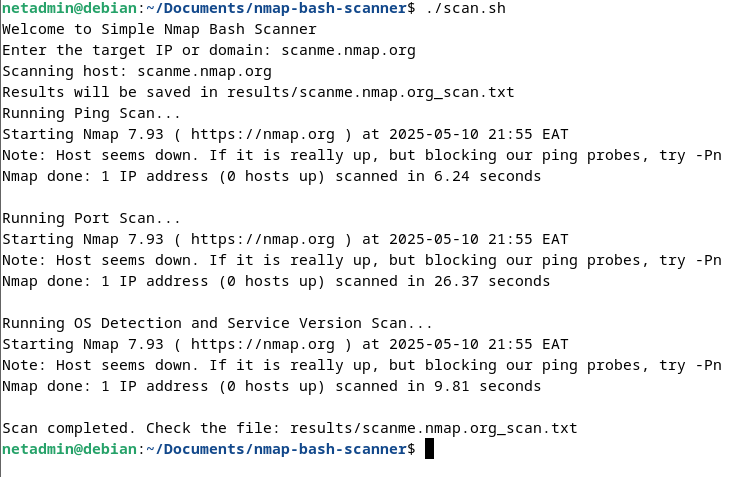

# Automated Network Reconnaissance Tool

This script automates basic network reconnaissance tasks using Nmap and Bash.

## Requirements
- Linux OS
- Nmap installed
- Bash shell

## Usage
1. Clone the repo:
	```bash
	git clone https://github.com/Quinter-Jaika/Nmap-bash-scanner
	 ```
2. Navigate to the directory
	```bash
	cd nmap-bash-scanner
	```
3. Make it executable
	```bash
	chmod +x scan.sh
	```
4. Confirm a folder for results exists
	```bash
	mkdir -p results
	```
5.  Run the scanner
	```bash
	./scan.sh
	```
6. Enter a target IP or domain when prompted

## Example Scan Output


*Figure: Running the scan.sh script with target "scanme.nmap.org"*

The script performs:
- Ping scan
- Port scan
- OS & service detection and saves the full result in the 'results' folder
